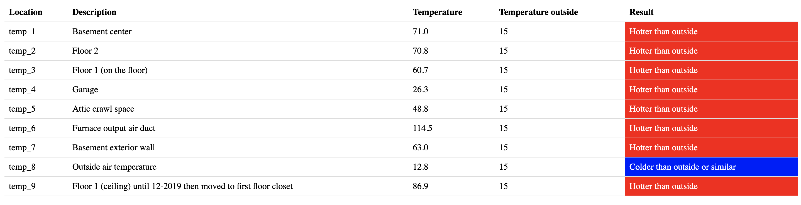
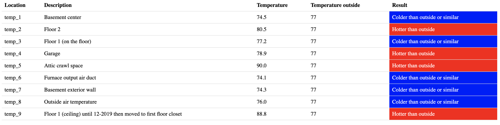

# Final Project

## Overview:
+ Data Source: Home Sensor data [.txt files with lists in it]
+ Result of project:
  + ETL - Extracting data from .txt, tranforming those into serilized data and loading into CSV file.
  + Data cleaning - cleaning data and dividing it into different types. Also ignoreing data with unxexpected time occurence.
  + Data Sampling - Resample data and interpolate on montly, weekly and daily bases.
  + API application - created flask application:
    + getDataHour - Gives average data of the hour of a particular day.
    + getDataDay - Gives average data of a particular day.
    + compare temperature: uses above links to get api of homesensor data and api.worldweatheronline.com for historical weather data.
        + compareHour - compare average hour home temperature data with weather that day.
        + compareDay - compare average day home temperature data with weather that day.


## Big Data Processing:

### 1. ETL and Data cleaning:
#### Execution and Explanation:
Since there were lot of files in one folder(actual data source - HOMESENSOR) I have used `os` library to go though each .txt file in the directory. 
```python
  for r,d,f in os.walk(path):
    #following variables will be used when setting headers
    prheader = 0
    ptheader = 0
    tdheader = 0
    ssheader = 0
    otheader = 0
    for file in f:
		readfile = open(os.path.join(r, file), 'r')
		filelines = readfile.read().split('\n')
      # logic - see below code
    readfile.close()
```
The following ETL is done on entire data source and also creates file with data pertainling within the dates given at the runtime
```
python3 json_to_CSV.py 2019-01-31 2019-03-30
```

Every line in each file has list (you can also say json) which starts with `{` but some lines may start with something other than that. That would be compile time error of the home sensors. Not only that some values of keys in this list may be missing, null, or even garbage as we cannot check each and every keys of each list of each file we need to make decision on what bases we want to clean our data. Since further I am going to resample this data and also use this data to build flask application which works on datetime, I will clean this data on `pitime` field. pitime is time and date msg was received by server. The list in this data house are of 3 main different types: `print_reading`, `trigger_data` and `system_data`. So I have created 3 different json list and 3 different CSV files for each type and also 1 extra for others, if there were any other type of data found.
```python
i = len(filelines)
j = 1
for line in filelines:
  if j >= i:
    break
  j+=1
  cleanline = line[line.find('{'):]
  l = json.loads(cleanline)
  print(str(l["pitime"][:2]))
  if str(l["pitime"][:2]) != '20':
      continue
  if l["type"] == 'print_reading':
    compdate = datetime.strptime(l["pitime"].split("T")[0]+ " " + str(l["pitime"].split("T")[1][1:].split(".")[0]), '%Y-%m-%d %H:%M:%S')
    l["pitime"] = compdate
    print_reading.append(l)
    if startd <= compdate <= endtd:
      print_reading_dt.append(l)
  elif l["type"] == 'trigger_data':
    trigger_data.append(l)
  elif l["type"] == 'system_start':
    system_start.append(l)
  else:
    others.append(l)
```
Setting header was another difficult part as the above loop is reading data from 338 files and the header for those 4 types are different, so I can't simply put logic to write header when this loop runs for the first time. I can't also use the logic that when 1 file is done reading then write the header in those 4 CSV files as there is no gurantee to say whether I found data(header) for `trigger_data` in just after first file. So I used few flags to do so, when I found 1st data for each type then write the header and set the flag to false after that. To write actual header I have created function that will write header/data and/or create file(see code after writing data section).
```python
if len(print_reading) == 1 and prheader == 0:
  write_file(print_reading,'Print_Reading.csv',0)
  prheader = 1

if len(print_reading_dt) == 1 and ptheader == 0:
  write_file(print_reading_dt,'Print_Reading_DT.csv',0)
  ptheader = 1
  
if len(trigger_data) == 1 and tdheader == 0:
  write_file(trigger_data,'Trigger_Data.csv',0)
  tdheader = 1

if len(system_start) == 1 and ssheader == 0:
  write_file(system_start,'System_Start.csv',0)
  ssheader = 1

if len(others) == 1 and otheader == 0:
  write_file(others,'Others.csv',0)
  otheader = 1
```
Writing data in file may take significant amount of time. So I used buffer to do so, that will write json list when it's lenght is 500 or its end of the file. Also I ccreated a function to actually write header and or data in the CSV files.
```python
if len(print_reading) == 500 or j>=i:
  write_file(print_reading,'Print_Reading.csv',1)
  del print_reading[:]
if len(print_reading_dt) == 500 or j>=i:
  write_file(print_reading_dt,'Print_Reading_DT.csv',1)
  del print_reading_dt[:]
if len(trigger_data) == 500 or j>=i:
  write_file(trigger_data,'Trigger_Data.csv',1)
  del trigger_data[:]
if len(system_start) == 500 or j>=i:
  write_file(system_start,'System_Start.csv',1)
  del system_start[:]
if len(others) == 500 or j>=i:
  write_file(others,'Others.csv',1)
  del others[:]
```
Write file function is below. Paramters:
+ List/data
+ File name
+ Flags: 2: Create CSV, 1: write json list into CSV, 0: write header into CSV.

```python
def write_file(json_list, file_name, c):
	if c == 2:
		data_file = open(file_name, 'w')
		csv_writer = csv.writer(data_file)
		data_file.close()
		return
	data_file = open(file_name, 'a')
	csv_writer = csv.writer(data_file)
	for row in json_list:
		if c == 0:
			csv_writer.writerow(row.keys())
		else:
			csv_writer.writerow(row.values())
	data_file.close()
```

There is another way to write json list into CSV file using pandas, but it takes significance amount of time and I also data inconsistancy and data loss with those CSV files.
```python
pandas.read_json(json.dumps(print_reading)).to_csv('P_PrintReading.csv', index= None, header= True)
```

#### Purpose/Application:
__Big data processing is very significant these days. There are sotwares/applications which handles enterprice level big data but this give us ability of understand what happends behind the scene. Null or garbage data from data soruces are no suprise in these big data so cleaning data becomes significantly important for future use or analysis.__

### 2. Data Sampling:
#### Execution and Explanation:
Resampling is done to reduce the data at a fix interval, such as daily, weekly, monthly or even yearly. It helps to squeeze the data and the big picture from the data.
```python
def parser(x):
    return datetime.strptime(x, '%Y-%m-%d %H:%M:%S')
data = pd.read_csv('Print_Reading.csv',parse_dates =["pitime"], index_col ="pitime", low_memory=False, date_parser=parser)
data.head()
monthly_resample = data.resample('M')
monthly_resample
```

### 3. Flask Application for API:
#### Execution and Explanation:
The Flask application has 5 endpoints and one home(root).
##### 1. Home - Root:
At this endpoint `Home.html` file is rendered and this .html file contains API and endpoint documentation
```python
@app.route("/")
def root():
    return render_template('home.html')
```
>Result at: `http://127.0.0.1:5000/`


##### 2. getDataHour:
This returns average data of the given hour of the day as json list. This endpoint accepts 2 arguments, date and hour. 
```python
@app.route("/getDataHour", methods=['GET','POST'])
def getdatahour():
    date = request.args.get('date')
    hour = request.args.get('hour')
    reader = csv.DictReader(open("Print_Reading.csv"))
    file = open('meandata.csv','w+')
    file.close()
    i = 1
    j = 1
    for line in reader:
        if i ==1:
            file = open('meandata.csv','a+')
            writer = csv.writer(file)
            writer.writerow(line.keys())
            file.close()
            i = 0
        rdate = line['pitime'].split(' ')[0]
        if rdate == date:
            rhour = line['pitime'].split(' ')[1][:2]
            if rhour == hour:
                j+=1
                file = open('meandata.csv','a+')
                writer = csv.writer(file)
                writer.writerow(line.values())
                file.close()
                if j == 60:
                    break
    df = pd.read_csv('meandata.csv')
    mean = df.mean(axis = 0).to_json()
    return mean
```

Try running this flask app and give this url:
> `http://127.0.0.1:5000/getDataHour?date=2019-01-20&hour=03`

##### 3. getDataDay:
This returns average data of the given day as json list. This endpoint accepts 1 arguments date.
```python
@app.route("/getDataDay", methods=['GET','POST'])
def getdataday():
    date = request.args.get('date')
    reader = csv.DictReader(open("Print_Reading.csv"))
    file = open('meandata.csv','w+')
    file.close()
    i = 1
    j = 1
    for line in reader:
        if i ==1:
            file = open('meandata.csv','a+')
            writer = csv.writer(file)
            writer.writerow(line.keys())
            file.close()
            i = 0
        rdate = str(line['pitime'].split(' ')[0])
        if rdate == date:
            j+=1
            file = open('meandata.csv','a+')
            writer = csv.writer(file)
            writer.writerow(line.values())
            file.close()
            if j == 1440:
                break
    df = pd.read_csv('meandata.csv')
    mean = df.mean(axis = 0).to_json()
    return mean
```
Try running this flask app and give this url:
> `http://127.0.0.1:5000/getDataDay?date=2019-01-20`

##### 4. compareHour:
This shows comparision of the average home temperature of the given hour of the day with the weather that hour of the day in Potsdam.
To compare this endpoint get responses from 2 sources.
First from this application's getDataHour endpoint, to get the average home temperature of the hour of the day.
```python
@app.route("/compareHour", methods=['GET','POST'])
def comparehour():
    date = request.args.get('date')
    hour = request.args.get('hour')
    response = requests.get("http://127.0.0.1:5000/getDataHour?date="+date+"&hour="+hour)
    jd = json.loads(response.text)
    tempmean = {}
    #to store all temperature in different dictionary
    for i in range(1,10):
        col = "temp_"+str(i)
        colmean = jd[col]
        tempmean[col] = colmean
```

Second to get historical weather data, I am requesting from api.worldweatheronline.com website. This website return API in XML format.
Here is the colapsed version of that XML API:

```xml
<data>
  <request>...</request>
  <weather>
    <date>2019-01-20</date>
    <astronomy>...</astronomy>
    <maxtempC>-18</maxtempC>
    <maxtempF>-0</maxtempF>
    <mintempC>-21</mintempC>
    <mintempF>-5</mintempF>
    <avgtempC>-20</avgtempC>
    <avgtempF>-3</avgtempF>
    <totalSnow_cm>23.4</totalSnow_cm>
    <sunHour>3.5</sunHour>
    <uvIndex>1</uvIndex>
    <hourly>...</hourly>
    <hourly>...</hourly>
    <hourly>...</hourly>
    <hourly>...</hourly>
    <hourly>...</hourly>
    <hourly>...</hourly>
    <hourly>...</hourly>
    <hourly>...</hourly>
  </weather>
</data>
```

Since I want to get hourly weather data and this website only give hourly data at 0(12 am),300(03 am),600(06 am),900(09 am),1200(12 pm),1500(03 pm),1800(06 pm),2100(9 pm), so I have to match hour parameter given to compareHour to the nearest of these. After that I am simply comparing and displaying as HTML
```python
hr = 0
    for hrr in range(0, 22, 3):
        print("5-8")
        hour = int(hour)
        if hour == (hrr-1):
            hr= hrr
            break
        elif hour == hrr:
            hr= hrr
            break
        elif hour == (hrr+1):
            hr = hrr
            break
        else:
            pass
    response = requests.get("http://api.worldweatheronline.com/premium/v1/past-weather.ashx?q=13676&date="+date+"&key=0cade1f7eea64fb885a221156200205")
    apidata = ET.fromstring(str(response.text))
    print("6")
    #print(apidata)
    for hourly in apidata.findall('weather/hourly'):
        time = int(int(hourly.find('time').text)/100)
        print("7")
        if time == hr:
            #print(time)
            temphr = hourly.find('tempF').text
            #print(temphr)
    temploc = {"temp_1":"Basement center", "temp_2":"Floor 2", "temp_3":"Floor 1 (on the floor)", "temp_4":"Garage", "temp_5":"Attic crawl space", "temp_6":"Furnace output air duct", "temp_7":"Basement exterior wall", "temp_8":"Outside air temperature", "temp_9":"Floor 1 (ceiling) until 12-2019 then moved to first floor closet" }
    html = '<html><style>th, td {padding: 8px;text-align: left;border-bottom: 1px solid #ddd;}</style><body><table style="border-collapse: collapse;width: 100%;"><tr><th>Location</th><th>Temperature</th><th>Temperature outside</th><th>Result</th></tr>'
    html = '<html><style>th, td {padding: 8px;text-align: left;border-bottom: 1px solid #ddd;}</style><body><table style="border-collapse: collapse;width: 100%;"><tr><th>Location</th><th>Description</th><th>Temperature</th><th>Temperature outside</th><th>Result</th></tr>'
    for key,value in tempmean.items():
        print("8")
        html+='<tr><td>'+str(key)+'</td><td>'+temploc[key]+'</td><td>'+str(round(value,1))+'</td><td>'+str(temphr)+'</td>'
        if int(value) > int(temphr):
            html += '<td style="color:white;background-color:red">Hotter than outside</td></tr>'
        else:
            html += '<td style="color:white;background-color:blue">Colder than outside or similar</td></tr>'
    html+= '</table></body></html>'
    return html
```
>Result at (in winters on Jan 30th 2019 at 07:00am): `http://127.0.0.1:5000/compareHour?date=2019-01-30&hour=07`



##### 5. compareDay:
Similar to compareHour but this enpoint compares at day level. And uses 2 sources
First from this application's getDataDay endpoint, to get the average home temperature of the day.
```python
@app.route("/compareDay", methods=['GET','POST'])
def compareDay():
    date = request.args.get('date')
    response = requests.get("http://127.0.0.1:5000/getDataDay?date="+date)
    jd = json.loads(response.text)
    tempmean = {}
    #to store all temperature in different dictionary
    for i in range(1,10):
        col = "temp_"+str(i)
        colmean = jd[col]
        tempmean[col] = colmean
```
Second to get historical weather data, I am requesting from api.worldweatheronline.com website then simply compare and display as HTML
```python
response2 = requests.get("http://api.worldweatheronline.com/premium/v1/past-weather.ashx?q=13676&date="+date+"&key=0cade1f7eea64fb885a221156200205")
    apidata = ET.fromstring(str(response2.text))
    print("6")
    #print(apidata)
    temphr = apidata.find('weather/avgtempF').text
    #print(temphr)
    temploc = {"temp_1":"Basement center", "temp_2":"Floor 2", "temp_3":"Floor 1 (on the floor)", "temp_4":"Garage", "temp_5":"Attic crawl space", "temp_6":"Furnace output air duct", "temp_7":"Basement exterior wall", "temp_8":"Outside air temperature", "temp_9":"Floor 1 (ceiling) until 12-2019 then moved to first floor closet" }
    html = '<html><style>th, td {padding: 8px;text-align: left;border-bottom: 1px solid #ddd;}</style><body><table style="border-collapse: collapse;width: 100%;"><tr><th>Location</th><th>Description</th><th>Temperature</th><th>Temperature outside</th><th>Result</th></tr>'
    for key,value in tempmean.items():
        print("8")
        html+='<tr><td>'+str(key)+'</td><td>'+temploc[key]+'</td><td>'+str(round(value,1))+'</td><td>'+str(temphr)+'</td>'
        if int(value) > int(temphr):
            html += '<td style="color:white;background-color:red">Hotter than outside</td></tr>'
        else:
            html += '<td style="color:white;background-color:blue">Colder than outside or similar</td></tr>'
    html+= '</table></body></html>'
    return html
```
>Result at (in summer on July 30th 2019): `http://127.0.0.1:5000/compareDay?date=2019-07-30`



#### Purpose/Application:
The sole purpose of creating flask application for this data set is to create API. This API can be used in many different ways just as I did to compare the temperature of different location in the house with the weather in Potsdam. The real world application of API is huge. One simple example is the weather API I used to get historic data. API makes it easy to interact with big amount of data, as you can request particular data from a huge data source.